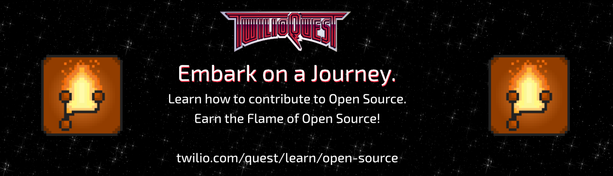

# Contributing to Open Pixel Art

¿Español? Puedes encontrar nuestra guía de contribuciones traducida en [este enlace](docs/es/CONTRIBUTING.md).

There are two ways you can contribute to this project. You can either contribute a single pixel to the canvas or you can contribute to the underlying project. For example by adding tests, updating the HTML template or updating documentation.

For both scenarios the setup is the same, however, the contribution steps differ slightly.

## I've Never Contributed to Open Source



Contributing to open source can be intimidating at first. For that reason we created a
new mission inside [TwilioQuest](https://www.twilio.com/quest) that will guide you
step-by-step through creating a contribution for this project. Once you [downloaded the game](https://www.twilio.com/quest/download) you'll be able to select the mission and
it will walk you through every step from cloning the project to creating your pull request.

Enjoy your quest!

## Requirements

- A GitHub account
- git installed on your computer. [Learn how to install it](https://help.github.com/en/articles/set-up-git)
- [Node.js](https://nodejs.org) and a package manager like [npm](https://npmjs.com)

## Setup Local Project

1. [Create a fork](https://help.github.com/en/articles/fork-a-repo) of this project
2. Clone the project:

```bash
git clone https://github.com/<YOUR_GITHUB_USERNAME>/open-pixel-art.git
```

If you've set up this device with SSH, you can do this instead:

```bash
git clone git@github.com:<YOUR_GITHUB_USERNAME>/open-pixel-art.git
```

3. Install the dependencies for local development

```bash
cd open-pixel-art
npm install
```

4. Start a local development server

```bash
npm start
```

5. Open your browser at http://localhost:8080. You should see the same content as on https://open-pixel-art.com just with a grid on the canvas that helps you better place your pixel.

---

There is also an option for setting up the project via Docker. To get started with the project by using Docker follow the following steps.

1. Build the Docker image

```bash
 docker build -t open-pixel-art .
```

2. Start the Docker image

```bash
docker run -d -p 8080:8080 -it open-pixel-art
```

If the docker image fails to build there's probably an error in your code and the tests fail to pass. If everything is correct you can easily connect by visiting the following url http://localhost:8080. You should see the same content as on https://open-pixel-art.com just with a grid on the canvas that helps you better place your pixel.

You can also verify if it's running by doing `docker ps --all` You will see an image called `open-pixel-art` and where you can access it as well.

Example:

```bash
CONTAINER ID        IMAGE               COMMAND                  CREATED             STATUS                         PORTS                     NAMES
c861ba4389fe        open-pixel-art      "docker-entrypoint.s…"   7 minutes ago       Up 7 minutes                   0.0.0.0:8080->8080/tcp    sleepy_lamarr
```

## Contributing a Pixel

If you want to contribute a pixel, you have to open the [`_data/pixels.json`](_data/pixels.json) file. It contains every pixel placed on the canvas.

### Create a new pixel

To create a new pixel, search for a gap between the numbers for either the `x` or `y` coordinates in the `data` array inside the `pixels.json`.
Once you have found an open position, go ahead and add a new pixel row.
A new pixel has to be an object with the following four properties:

- `x`: The x-coordinate of your pixel. `0` is the left-most column of pixels
- `y`: The y-coordinate of your pixel. `0` is the bottom-most row of pixels
- `color`: The color your pixel should have as a hex code (e.g. #ff0000 for red)
- `username`: The GitHub username you'll use to create the pull request

The row for your pixel should be sorted by the y-coordinate first and then by the x-coordinate. If you are unsure about your changes, make the change and run `npm run format:sort-pixels` and it should sort your pixel into the appropriate position.

The change should look like this:

```diff
{
  "data": [
    {"y": 1, "x": 3, "color": "#F22F46", "username": "twilio-labs"},
+    { "y": 1, "x": 4, "color": "#FFFF00", "username": "dkundel"},
    {"y": 2, "x": 9, "color": "#F22F46", "username": "twilio"},
    ...
  ]
}
```

### Verifying your changes

Once you did your change, go over to http://localhost:8080 and you should see your new pixel. If you are not happy with the placement, keep changing the `x` and `y` values and if you are not happy with the `color` you can keep changing the `color` property.

Afterwards make sure that all tests are still passing by running in a different terminal:

```bash
npm test
```

### Branching and Committing

Once you are happy with the changes, create a [branch](https://help.github.com/en/articles/about-branches) so we can commit the changes.

```bash
git checkout -b add-my-new-pixel
```

Afterwards you'll have to pick your change and commit it by running:

```bash
git add _data/pixels.json
git commit -m "feat(pixels): add my new pixel (x, y)"
```

Replace `(x, y)` with the x-coordinate and y-coordinate of your changed pixel, e.g. `(4, 27)`.
This will create a new commit with the message `feat(pixels): add my new pixel (4, 27)`.
The commit message is following the [Conventional Commits Standard](https://www.conventionalcommits.org/en/v1.0.0-beta.4/).

### Push Your Changes and Creating a Pull Request

**Note:** If you're having trouble pushing your changes to GitHub, your local branch of the repository may not be up-to-date with the current repository because of additions from other contributors. Before you push your changes to GitHub, you might need to [sync your fork with the upstream repository](https://help.github.com/en/articles/syncing-a-fork). Try run `npm run sync-fork` to sync your fork automatically.

Push your changes to GitHub by running:

```bash
git push origin add-my-new-pixel
```

Afterwards head to GitHub and [follow these instructions](https://help.github.com/en/articles/creating-a-pull-request-from-a-fork) to create a pull request from your fork against the `master` branch of github.com/twilio-labs/open-pixel-art.

### Problems When Creating a Pull Request

When many users are creating pull requests at the same time then it might be hard to get your branch up to date. The easiest way to overcome this problem is to run the following commands which brings all the required changes to your forked repo.

Make sure you have the latest changes by running this command

```bash
npm install
```
Now you can just sync it with the fork by running this command
```bash
npm run sync-fork
```

## Contributing other Changes

It's great that you want to contribute more than a pixel to this project. Before you start working on the code, make sure to check if there is already a [GitHub issue](https://github.com/twilio-labs/open-pixel-art/issues) for those changes. If there isn't, please open one first. If there is already one, make sure to create a comment to let people know that you are working on a fix for this.

After making the code changes, please follow the steps outlined above.

Once you open a pull request, make sure to uncomment the additional info section in the pull request template and add a description as well as reference any issues this is addressing.

### Documentation Contribution Guidelines

Please do not open pull requests for inconsequential grammatical changes in the README or other documentation. These types of contributions aren't in the spirit of Hacktoberfest and won't be accepted.

Examples of unwanted contributions include but are not limited to:

- adding unnecessary commas, hyphens, or exclamation points
- rewording sentences that are already clear enough
- changing spelling from American English to British English

These kinds of documentation contributions are welcome and appreciated:

- adding translations into new languages
- Fixing broken links
- Fixing broken markdown formatting
- Fixing typos or misspelled words

## Project Structure

```
open-pixel-art
├── .all-contributorsrc
├── .eleventy.js
├── .eleventyignore
├── .git
├── .github
├── .gitignore
├── .mergify.yml
├── .prettierrc
├── .vscode
├── CODE_OF_CONDUCT.md
├── CONTRIBUTING.md
├── LICENSE
├── README.md
├── __tests__
├── _data
├── assets
├── dangerfile.js
├── index.njk
├── package-lock.json
├── package.json
└── styles
```

### `.eleventy.js` and `.eleventyignore`

The project is powered by [Eleventy](https://11ty.io). These are the configuration files for the project

### `.mergify.yml`

The project uses [Mergify](https://mergify.io) to auto-merge certain PRs based on some conditions.

### `__tests__`

This directory contains all [Jest](https://jestjs.io)-powered unit tests

### `_data`

The `_data` directory contains the `pixels.json` file that represents every single pixel on the canvas, a `defaults.json` file that contains any default values like the size of the canvas, and the `env.js` file for any environment related values. All data will be automatically available in the `index.njk` file.

### `assets`

A directory for any static assets.

### `dangerfile.js`

We use [Danger](https://danger.systems/js) to perform some code review checks. This file contains the logic for that.

### `index.njk`

This is the template file that is used to generate the HTML of the website.

### `styles`

This directory contains any custom CSS written. The styles for [`index.njk`](index.njk) are in [`styles/main.css`](styles/main.css)

## Code of Conduct

We want to make sure that this project is as welcoming to people as possible. By interacting with the project in any shape or form you are agreeing to the project's [Code of Conduct](CODE_OF_CONDUCT.md). If you feel like another individual has violated the code of conduct, please raise a complaint to [open-source@twilio.com](mailto:open-source@twilio.com).

## Licensing

All third party contributors acknowledge that any contributions they provide will be made under the same open source license that the open source project is provided under.
