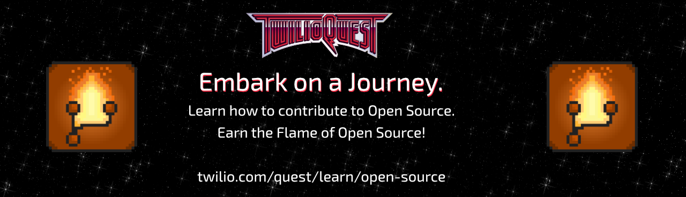

# Open Pixel Art by [Twilio](https://www.twilio.com)

   [![Learn with TwilioQuest](https://img.shields.io/static/v1?label=TwilioQuest&message=Learn%20to%20contribute%21&color=F22F46&labelColor=1f243c&style=flat-square&logo=data:image/png;base64,iVBORw0KGgoAAAANSUhEUgAAAIAAAACACAMAAAD04JH5AAAASFBMVEUAAAAZGRkcHBwjIyMoKCgAAABgYGBoaGiAgICMjIyzs7PJycnMzMzNzc3UoBfd3d3m5ubqrhfrMEDu7u739/f4vSb/3AD///9tbdyEAAAABXRSTlMAAAAAAMJrBrEAAAKoSURBVHgB7ZrRcuI6EESdyxXGYoNFvMD//+l2bSszRgyUYpFAsXOeiJGmj4NkuWx1Qeh+Ekl9DgEXOBwOx+Px5xyQhDykfgq4wG63MxxaR4ddIkg6Ul3g84vCIcjPBA5gmUMeXESrlukuoK33+33uID8TWeLAdOWsKpJYzwVMB7bOzYSGOciyUlXSn0/ABXTosJ1M1SbypZ4O4MbZuIDMU02PMbauhhHMHXbmebmALIiEbbbbbUrpF1gwE9kFfRNAJaP+FQEXCCTGyJ4ngDrjOFo3jEL5JdqjF/pueR4cCeCGgAtwmuRS6gDwaRiGvu+DMFwSBLTE3+jF8JyuV1okPZ+AC4hDFhCHyHQjdjPHUKFDlHSJkHQXMB3KpSwXNGJPcwwTdZiXlRN0gSp0zpWxNtM0beYE0nRH6QIbO7rawwXaBYz0j78gxjokDuv12gVeUuBD0MDi0OQCLvDaAho4juP1Q/jkAncXqIcCfd+7gAu4QLMACCLxpRsSuQh0igu0C9Svhi7weAGZg50L3IE3cai4IfkNZAC8dfdhsUD3CgKBVC9JE5ABAFzg4QL/taYPAAWrHdYcgfLaIgAXWJ7OV38n1LEF8tt2TH29E+QAoDoO5Ve/LtCQDmKM9kPbvCEBApK+IXzbcSJ0cIGF6e8gpcRhUDogWZ8JnaWjPXc/fNnBBUKRngiHgTUSivSzDRDgHZQOLvBQgf8rRt+VdBUUhwkU6VpJ+xcOwQUqZr+mR0kvBUgv6cB4+37hQAkXqE8PwGisGhJtN4xAHMzrsgvI7rccXqSvKh6jltGlrOHA3Xk1At3LC4QiPdX9/0ndHpGVvTjR4bZA1ypAKgVcwE5vx74ulwIugDt8e/X7JgfkucBMIAr26ndnB4UCLnDOqvteQsHlgX9N4A+c4cW3DXSPbwAAAABJRU5ErkJggg==)](https://twil.io/learn-open-source)

This is an art project created with the intention to teach you how to create a pull request.

Visit [open-pixel-art.com](https://open-pixel-art.com) to see the full artwork!

Anyone who wishes to learn how to create a pull request for a project on GitHub can use this project to contribute a pixel to the canvas. You will only be able to ever create one pixel but you can pick whatever color you prefer as long as it is a valid HEX code. For example: `#F22F46` the brand color of [Twilio](https://www.twilio.com)

> 
> If you are new to open-source, GitHub or git in general, fear not, we created a tutorial in [TwilioQuest](https://twil.io/hacktoberfest-quest) for you. It will teach you step by step on how you can get started and will guide you on your quest of creating your pull request.
> 🕹 [Download TwilioQuest](https://www.twilio.com/quest/download)

The entire project is automated and is largely maintained by a set of bots that will verify any pixel contributions. However, if you'd like to know more about the project or submit other contributions to the project that are not a pixel, feel free to create a [GitHub issue](https://github.com/twilio-labs/open-pixel-art/issues) inside the [Open Pixel Art project](https://github.com/twilio-labs/open-pixel-art).

## Contributing

In order to contribute a pixel to the canvas, you'll have to create a [pull request](https://opensource.guide/how-to-contribute/#opening-a-pull-request) to the [Open Pixel Art project on GitHub](https://github.com/twilio-labs/open-pixel-art).

If you are already familiar with git and how to create a pull request on GitHub, you can go ahead and check out the [contributing guide](CONTRIBUTING.md).

We understand that contributing to open-source can be intimidating and as a result we created a mission in our interactive coding game [TwilioQuest](https://twil.io/hacktoberfest-quest) that will walk you step by step through creating a pull request for this project and help you embark on your new quest into open-source!

- [Download TwilioQuest](https://www.twilio.com/quest/download)
- Check out the Contribution Guides:
  - [English](CONTRIBUTING.md)
  - [Español](docs/es/CONTRIBUTING.md)
  - [Deutsch](docs/de/CONTRIBUTING.md)
  - [Brazilian Portuguese](docs/br/CONTRIBUTING.md)
  - [Chinese Mandarin](docs/zh/CONTRIBUTING.md)
  - [Dutch](docs/nl/CONTRIBUTING.md)

## Code of Conduct

We want to make sure that this project is as welcoming to people as possible. By interacting with the project in any shape or form you are agreeing to the project's Code of Conduct:

- [English](CODE_OF_CONDUCT.md)
- [Español](docs/es/CODE_OF_CONDUCT.md)
- [Deutsch](docs/de/CODE_OF_CONDUCT.md)
- [Brazilian Portuguese](docs/br/CODE_OF_CONDUCT.md)

If you feel like another individual has violated the code of conduct, please raise a complaint to [open-source@twilio.com](mailto:open-source@twilio.com).

## Contributors

Thanks goes to these wonderful people ([emoji key](https://allcontributors.org/docs/en/emoji-key)):

<!-- ALL-CONTRIBUTORS-LIST:START - Do not remove or modify this section -->
<!-- prettier-ignore -->
<table>
  <tr>
    <td align="center"><a href="https://dkundel.com"> <b>Dominik Kundel</b></a> <a href="https://github.com/twilio-labs/open-pixel-art/commits?author=dkundel" title="Code">💻</a> <a href="#ideas-dkundel" title="Ideas, Planning, & Feedback">🤔</a></td>
    <td align="center"><a href="https://aimhigherwebdesign.com.au"> <b>Amy Kapernick</b></a> <a href="https://github.com/twilio-labs/open-pixel-art/commits?author=amykapernick" title="Code">💻</a></td>
    <td align="center"><a href="https://github.com/kwhinnery"> <b>Kevin Whinnery</b></a> <a href="https://github.com/twilio-labs/open-pixel-art/commits?author=kwhinnery" title="Code">💻</a></td>
    <td align="center"><a href="http://rickyrobinett.com"> <b>Ricky Robinett</b></a> <a href="https://github.com/twilio-labs/open-pixel-art/commits?author=rickyrobinett" title="Code">💻</a></td>
    <td align="center"><a href="https://github.com/andrescalco"> <b>André Felipe Scalco</b></a> <a href="https://github.com/twilio-labs/open-pixel-art/commits?author=andrescalco" title="Code">💻</a></td>
    <td align="center"><a href="https://gustiaux.com"> <b>Teddy Gustiaux</b></a> <a href="https://github.com/twilio-labs/open-pixel-art/commits?author=teddy-gustiaux" title="Code">💻</a></td>
    <td align="center"><a href="https://github.com/AidanJSmith"> <b>Aidan Smith</b></a> <a href="https://github.com/twilio-labs/open-pixel-art/commits?author=AidanJSmith" title="Code">💻</a></td>
  </tr>
  <tr>
    <td align="center"><a href="https://github.com/TheHandsomeCoder"> <b>Scott O'Malley</b></a> <a href="https://github.com/twilio-labs/open-pixel-art/commits?author=TheHandsomeCoder" title="Code">💻</a></td>
    <td align="center"><a href="http://www.toddmoy.com"> <b>Todd Moy</b></a> <a href="https://github.com/twilio-labs/open-pixel-art/commits?author=toddmoy" title="Code">💻</a></td>
    <td align="center"><a href="http://www.samueldurkin.com"> <b>Samuel Durkin</b></a> <a href="https://github.com/twilio-labs/open-pixel-art/commits?author=FailedSitcom" title="Code">💻</a></td>
    <td align="center"><a href="https://github.com/nokenwa"> <b>ChatterboxCoder</b></a> <a href="https://github.com/twilio-labs/open-pixel-art/commits?author=nokenwa" title="Code">💻</a></td>
    <td align="center"><a href="https://github.com/simeydk"> <b>Simey de Klerk</b></a> <a href="https://github.com/twilio-labs/open-pixel-art/commits?author=simeydk" title="Code">💻</a></td>
    <td align="center"><a href="https://github.com/annthurium"> <b>Tilde Ann Thurium</b></a> <a href="#review-annthurium" title="Reviewed Pull Requests">👀</a></td>
    <td align="center"><a href="https://gitlab.com/dpeukert"> <b>Daniel Peukert</b></a> <a href="https://github.com/twilio-labs/open-pixel-art/commits?author=dpeukert" title="Documentation">📖</a></td>
  </tr>
  <tr>
    <td align="center"><a href="https://github.com/izontm"> <b>izontm</b></a> <a href="https://github.com/twilio-labs/open-pixel-art/commits?author=izontm" title="Documentation">📖</a></td>
    <td align="center"><a href="https://github.com/carlyrobison"> <b>Carly Robison</b></a> <a href="https://github.com/twilio-labs/open-pixel-art/commits?author=carlyrobison" title="Documentation">📖</a></td>
  </tr>
</table>

<!-- ALL-CONTRIBUTORS-LIST:END -->

This project follows the [all-contributors](https://github.com/all-contributors/all-contributors) specification. Contributions of any kind welcome!

## Technology Thank You

This project is powered by various open-source projects. Among others:

- [Eleventy](https://www.11ty.io/) for the static site generation
- [Danger](https://danger.systems/js/) for the automated code review
- [Mergify](https://github.com/mergifyio) for automated PR merging
- [All Contributors Bot](https://github.com/all-contributors/all-contributors-bot) to recognize the contributions of everyone
- [Jest](https://jestjs.io/) for Unit Testing
- [NES.css](https://nostalgic-css.github.io/NES.css/) for the CSS styling
- [Welcome Bot](https://github.com/behaviorbot/welcome) to welcome new contributors

## License

MIT
