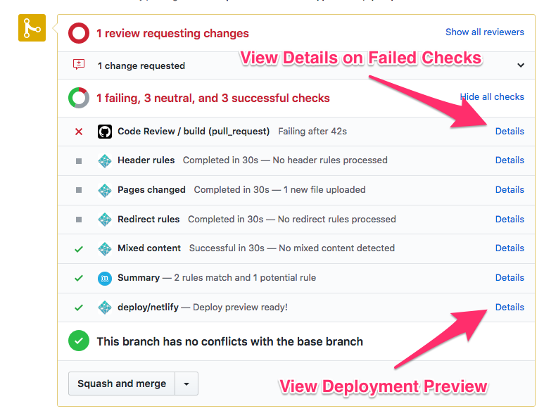

# Maintainers

## List of current maintainers

The following people are the current maintainers. Feel free to reach out to them for any questions.

- [Ryan Kubik @rmkubik](https://github.com/rmkubik)
  - Pronouns: he/him

## Process Steps For Maintainers

The project is powered by [GitHub Actions](https://github.com/features/actions) and ideally Pixel Contributions should be merged automatically by [`mergify`](https://mergify.io/) but sometimes things go wrong and we need to manually review.

These are some guides on how to deal with those PRs

### Pixel Contributions

1. Make sure the person is a first-time contributor. There is a badge at the top of the PR
    1. If they are not a first-time contributor but are contributing a pixel, make sure they do not have another merged PR with a pixel. You can either search the PRs or look in `_data/pixels.json` file.
2. Make sure the pixel contribution is valid in the first place by checking the `Files changed` tab
   - there should not be any other files touched
   - the coordinates of the pixel should be less than `40`
     - if this is the case, you can use the following message template to request changes
       > Hey @rmkubik it seems like that someone unfortunately already grabbed the pixel you are trying to contribute. Could you please [sync your fork](https://help.github.com/en/articles/syncing-a-fork) or run `npm run sync-fork` and contribute a different pixel instead? Thank you for your contribution!
   - the `username` should be the same as their GitHub username they are using to open the PR
   - they are not overriding another person's pixel
     - if this is the case, you can use the following message template to request changes
       > Hey @rmkubik it seems like that you grabbed the pixel that is outside of the canvas. Any coordinate needs to be smaller than 40. Could you please [sync your fork](https://help.github.com/en/articles/syncing-a-fork) or run `npm run sync-fork` and contribute a different pixel instead? Thank you for your contribution!
3. Check if the PR has a merge conflict. You can see it at the bottom of the page. If there is a merge conflict:
   1. Press the `Resolve conflict` button
   2. Generally press `Accept Current`. The only exception is if the conflict involves the user who created the PR. In that case:
      - Copy their pixel contribution
      - `Accept Current` instead
      - Paste the pixel contribution into the right place
   3. Once all merge conflicts have been resolved, scroll to the top and finish the resolving at the top right by committing the changes
   4. Wait for the checks to perform again. If everything succeeds the bot should automerge
4. If everything looks fine until now, open the `Details` part of the `Code Review / build (pull_request)` and make sure that everything passes except `Danger`. If `Danger` failed with a message that some pixels are being deleted but you can't find any removed lines in the `Files changed` tab, that means their PR is just out of sync. Feel free to squash the PR manually if everything else passes.

### Non-Pixel Contributions

1. Add yourself as a reviewer to claim the PR
2. Make sure the changes build and deploy. You can see this if the `deploy/netlify` task is marked green.
   a. [if applicable] Click the `Details` link for the `deploy/netlify` link to see the deploy preview page. This allows you to manually test the changes on the website
3. Make sure Unit Tests pass by clicking the `Details` link on `Code Review / build (pull_request)`. The `Danger` part of this is intended to fail, but every other task especially `npm install, build and test` should pass
4. Review the code and request any changes if necessary. Otherwise click the `Approve` button under `Review changes` in the `Files changed` tab
5. Squash the changes and if necessary update the commit message to fit the [conventional commit message style](https://github.com/angular/angular/blob/master/CONTRIBUTING.md#commit)
6. Make sure any related issues are closed
